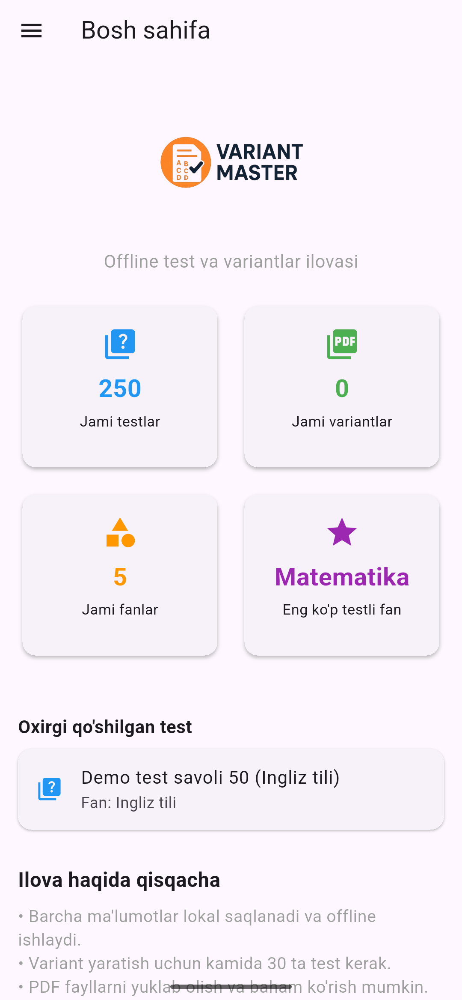
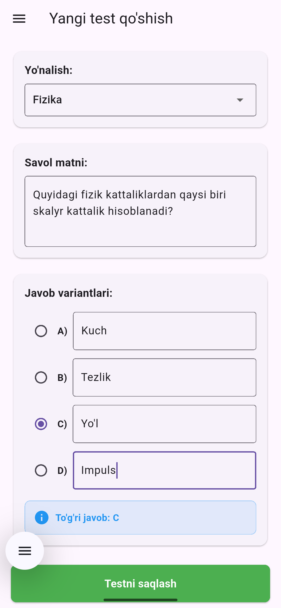
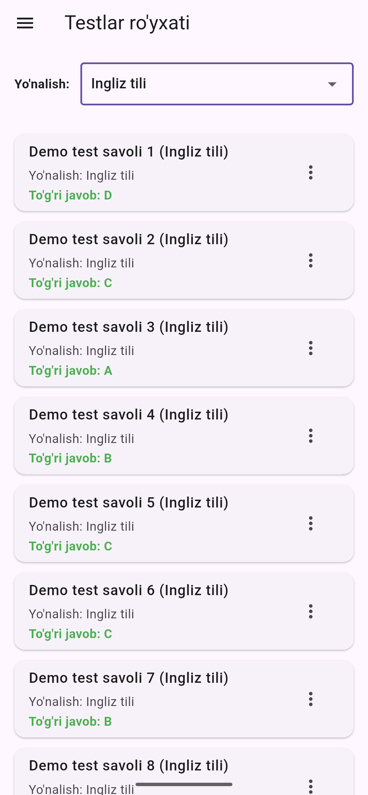
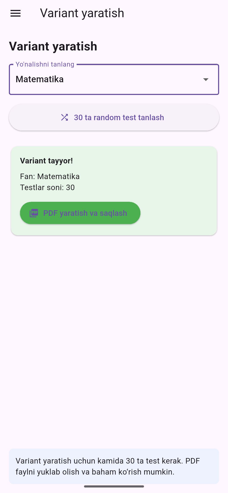
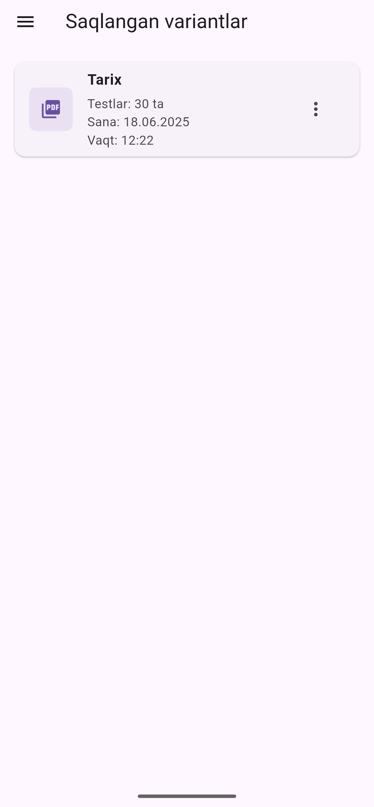
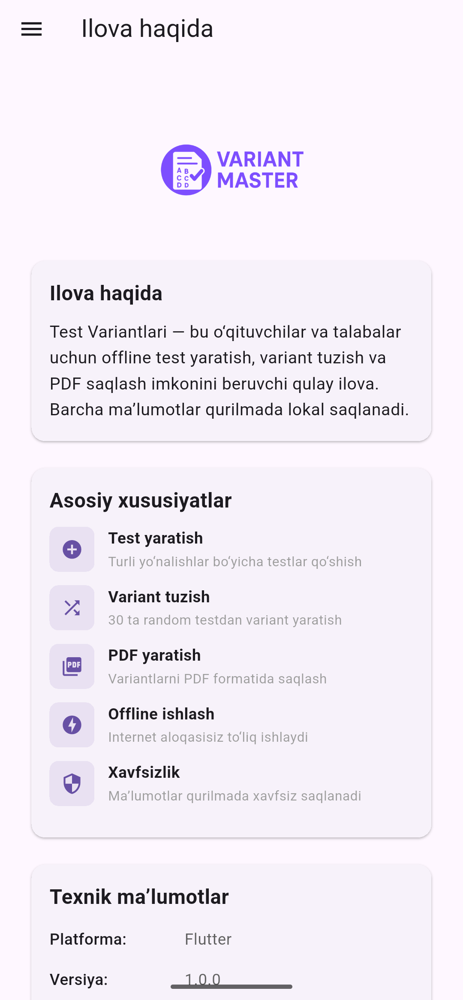

# Variant Master

Variant Master — bu o‘qituvchilar va talabalar uchun offline test va variant yaratish ilovasi. Ilova yordamida siz testlar qo‘shishingiz, 30 ta random testdan variant tuzishingiz va PDF formatida saqlashingiz mumkin. Barcha ma’lumotlar qurilmada lokal saqlanadi, internet talab qilinmaydi.

## 📱 Asosiy xususiyatlar

- Foydalanuvchi hisobisiz va offline ishlaydi
- Testlar qo‘shish va tahrirlash
- Yo‘nalish (fan) bo‘yicha testlarni ajratish
- 30 ta random testdan variant yaratish
- Variantlarni PDF ko‘rinishda saqlash va baham ko‘rish
- Saqlangan variantlar ro‘yxati
- Dark/Light mode va shrift o‘lchamini boshqarish
- Drawer menyu asosida qulay navigatsiya
- Barcha matnlar o‘zbek tilida

## 🖼️ Ilova ko‘rinishlari

(Screenshotlar uchun joy)

## 🚀 Boshlash

### 1. Klonni yuklab oling

```sh
git clone https://github.com/yourusername/variant_master.git
cd variant_master
```

### 2. Paketlarni o‘rnating

```sh
flutter pub get
```

### 3. Hive adapterlarini generatsiya qiling

```sh
flutter pub run build_runner build --delete-conflicting-outputs
```

### 4. Android/iOS uchun build

```sh
flutter run
```

### 5. Demo testlarni avtomatik yuklash

Ilova birinchi ishga tushganda har bir fan uchun 50 tadan demo test avtomatik yuklanadi.

## ⚙️ Texnik ma’lumotlar

- **Platforma:** Flutter
- **Lokal baza:** Hive
- **PDF:** pdf, printing package
- **Ikonkalar:** iconsax
- **State management:** setState (oddiy ilova uchun)

## 📂 Papka tuzilmasi

```
lib/
  main.dart
  models/
    test_model.dart
    variant_model.dart
  pages/
    home_page.dart
    add_test_page.dart
    create_variant_page.dart
    saved_variants_page.dart
    settings_page.dart
    about_page.dart
```

## 📝 Foydalanish

- Drawer menyudan kerakli bo‘limni tanlang
- Yangi test qo‘shing va yo‘nalishini belgilang
- Variant yaratish bo‘limida fan tanlab, 30 ta random testdan PDF variant yarating
- Saqlangan variantlarni ko‘ring va PDF faylni yuklab oling yoki baham ko‘ring

## 🛠️ Dasturchilar uchun

- Kodlar toza va izohlangan
- Har bir sahifa uchun alohida widget
- Model va local storage Hive orqali
- Demo testlar uchun `main.dart`da `insertDemoTests()` funksiyasi mavjud

## 📸 Screenshotlar

<table>
  <tr>
    <td align="center"><br>Bosh sahifa</td>
    <td align="center"><br>Yangi test qo‘shish</td>
    <td align="center"><br>Testlar ro‘yxati</td>
  </tr>
  <tr>
    <td align="center"><br>Variant yaratish</td>
    <td align="center"><br>Variantni saqlash</td>
    <td align="center"><br>Ilova haqida</td>
  </tr>
</table>

## 👨‍💻 Muallif va hissa qo‘shuvchilar

- [Ismingiz yoki GitHub profilingiz]

## 📄 Litsenziya

MIT
